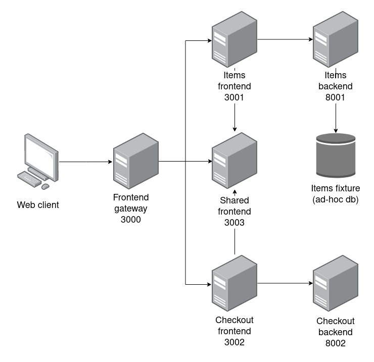

# Pet shop micro services

This is the documentation for the pet shop microservices project.

## Architecture

This project is structured as a monorepo, meaning that all of the services necessary to run this project are all found in a single repo (this one). The monorepo is managed using [lerna](https://lerna.js.org/). There are 2 types of microservices: frontend microservices and backend microservices. Each individual microservice is an independent node project, found inside the `packages` folder. 

Each frontend micro service is developed using [React](https://reactjs.org/) and [styled-components](https://styled-components.com/). The frontend micro services are build and linked together using [Webpack5](https://webpack.js.org/) with [module federation](https://webpack.js.org/concepts/module-federation/). 

Each backend micro service is developed using [ExpressJS](https://expressjs.com/). The current database is just a json fixture.

## Setting up the project

The prerequisites for this project are the following:
* Node 14
* npm

Run the following command, to install all the needed packages:
> npx lerna bootstrap

Afterwards, run the following command to build and run the docker containers:
> sudo docker-compose up --build

After the build has finished and the containers have successfully started running, go to http://localhost:3000 and check if the project is running. You should see the main page of the application.